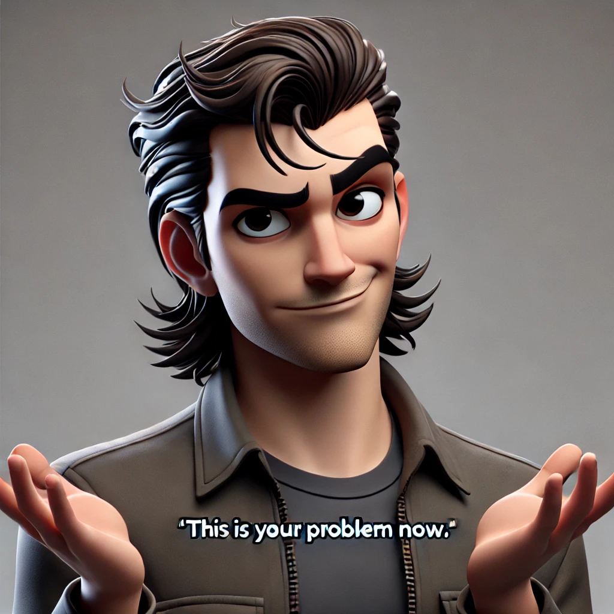

# Vandelay Industries - Part I
Before diving into the story, a few technical prerequisites.
feel free to use any network investigation tools you fancy, in the solution sheet, we use the most raw and open-source tools we could find.

## What is Vandeley Industries?
Vandelay Industries is a company founded by George Costanza along with Jerry Seinfeld, that is in the Import and Export business.
Import and Export of what? 
latex.... and....... latex based products.
 
yes.

ANYWAY! Vandelay Industries is a new and **upcoming company** with great potential, and is catching a lot of attention from its rivals and other opponents from beyond the field. which is latex. we think

What we do know is that the business was established in September 2019 and keeps growing by the day even though it only consists of two employees

### The grand CEO - George Costanza
* Has a short temper
* Has tendency of being lazy
* Looks busy and let others do the work for him
* His email address is `george@vandelay.com`
 
 

### Jerry
* Mostly apathetic
* Tends to gossip
* Cynical - used to do stand-up comedy once
* His email address is `jerry@vandelay.com`

Some stuff we know because we just know, take our word for it:
1. The company communicates mostly via emails.
2. The company uses a file and data server.
3. The server provide more services than storage.

## Now Vandeley needs you
Business was fine until one day, **Vandelay Industries got hacked!** (maybe)
There’s been a suspicion that information has been compromised from the company’s databases with the intention of that information being sold for a lot of money.

What we know:
* Company’s owner is a silent partner named Art Vandelay, a former Architect and a current Marine Biologist (who George looks up to). 
* The network traffic is recorded 24/7 - the pcap was carved to match the date and time of the 
alleged breach.
* It’s been theorised that the attacker might be someone the employees know.
* 4 days before the security breach, a letter has been placed under the 
company’s door without a stamp.
 

### Art Vandelay, the shareholder and founder, wants to know:
* What information was leaked?
* Who is responsible?
* Who is the attacker? 
* Where is he now?
* How can we get to him?

### In order do declare this case as closed, we need you to use your investigator skills and answer these questions:

What IP addresses were involved and who they belong to?
What known ports are being used?
What are the passwords for George and Jerry’s email?
What other email addresses you can find and what are their passwords?
Where does Kramer live?
In which sites were the employees browsing?
What is the password of the File Server?
What was the biggest TCP conversation?
Create a timeline of what happened based on what you find.

# Good Luck (& enjoy)
