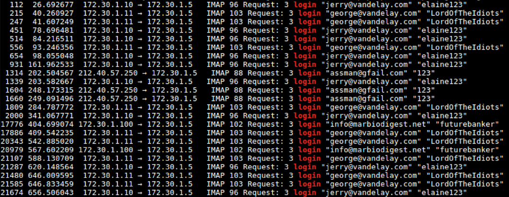
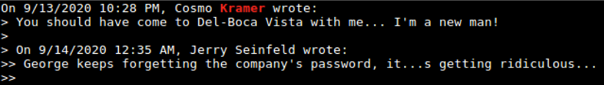

# Solution
(we won't tell Art Vandeley you peaked)

in this solution sheet we will be using:
* tshark (the engine behind wireshark)
* tcpdump
* sort
* grep

We will be going over all the questions mentioned
1. What IP addresses were involved and who they belong to?
    To get only the LAN addresses that are involved, we can use tshark with a simple grep and regex filter:

    ```tshark -r George\ is\ in\ too\ deep.pcap -T fields -e ip.src | grep -E "^(192|172|10)" | sort -u```

    <br>NOTE: the grep filter can be more specific, but this way is good enough in the sense of narrowing down the search

   <br>The addresses we get are
   * 172.30.1.10
   * 172.30.1.11
   * 172.30.1.100
   * 172.30.1.5
   To know who they belong to, we can first look for the SMB protocol being used (in case of a Windows machine):
   
   ```tshark -r George\ is\ in\ too\ deep.pcap -Y "smb"```
   
   <br>And now we have a match for almost all of them
   * 172.30.1.10 - JERRY-PC
   * 172.30.1.11 - GEORGECOSTANZA
   * 172.30.1.100 - no matches, non-Windows machine.
   * 172.30.1.5 - OFFICE-SERVER

2. What known ports are being used?<br>
   Because there are probably a lot of ports being used, we can `tshark` with `grep` regex filter:<br>
   ```tshark -r George\ is\ in\ too\ deep.pcap -T fields -e tcp.srcport | grep -E "^([0-9]{4}|[0-9]{3}|[0-9]{2}|[0-9])$" | sort -u```<br>
   ```tshark -r George\ is\ in\ too\ deep.pcap -T fields -e udp.srcport | grep -E "^([0-9]{4}|[0-9]{3}|[0-9]{2}|[0-9])$" | sort -u```
   The common ports we got:
   * 21
   * 80
   * 53
   * 137
   * 138
   * 139
   * 443
   * 445
   * 587
   * 3389
   * 143

3. What are the passwords for George and Jerry's email?<br>
   There are a few ways to recover the passwords. because we saw in the previous question that the IMAP protocol has been used, the simplest way to carve all the email passwords in the PCAP<br>
   ```tshark -r George\ is\ in\ too\ deep.pcap -Y "map" | grep -i jerry | grep login```<br>
   will give us the answer `"jerry@vandeley.com" "elaine123"`<br>
   Doing the same for George:
   ```tshark -r George\ is\ in\ too\ deep.pcap -Y "map" | grep -i george | grep login```<br>
   will give us `"george@vandeley.com" "LordOfTheIdiots"`<br>
4. What other email addresses you can find and what are their passwords?
   we can simply take the same query without the name grep
   ```tshark -r George\ is\ in\ too\ deep.pcap -Y "map" | grep login```<br>
   
   so by excluding the ones we already know, we are left with
   * `assman@gfail.com`, with the passwords "123"
   * `info@marbiodigest.net`, with the password: "futurebanker"
5. Where does Kramer live?<br>
   Firstly, let’s find out who Kramer is:<br>
   ```tcpdump -r George\ is\ in\ too\ deep.pcap | grep -i kramer```<br>
   So we know this:
   * Full name is Cosmo Kramer
   * His email address is assman@gfail.com
   * Communicating through IMAP\IMF protocol with Jerry and George from `212.40.57.250`, probably the WAN address.
   * We also reveal some SQL record name 'customers' with:
     * Full name
     * Email address - assman@yahoo.com (maybe inactive or additional account)
     * Phone number 555-7455<br>
   
   But we still know nothing about an address... let's check some of the email correspondence<br>
   ```tcpdump -r George\ is\ in\ too\ deep.pcap | grep -i kramer -A 7```<br>
   **NOTE**: `-A 7` means that 7 lines after the row with the word 'kramer' will also be presented<br><br>
   In one correspondent to Jerry (packet #1121), we can see that Kramer suggested Jerry to come to **Del-Boca Vista** with him:
   <br>
   We can also see the first email was sent by Jerry.
