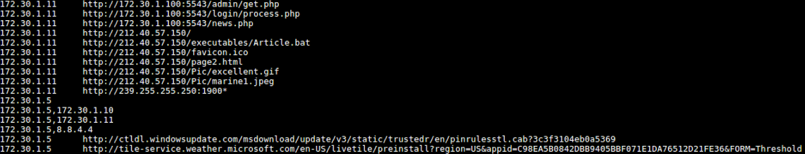
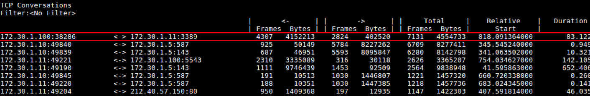
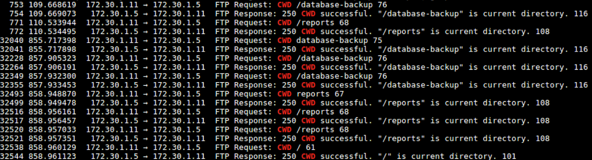
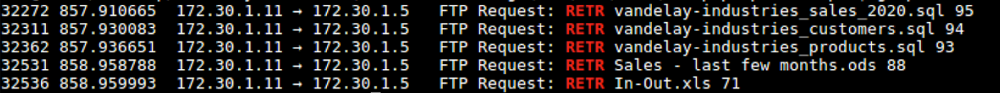
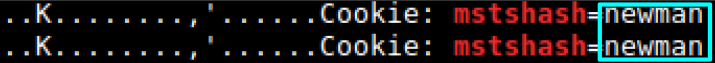

# Solution
(we won't tell Art Vandeley you peaked)

in this solution sheet we will be using:
* tshark (the engine behind wireshark)
* tcpdump
* sort
* grep

We will be going over all the questions mentioned
### What IP addresses were involved and who they belong to?
To get only the LAN addresses that are involved, we can use tshark with a simple grep and regex filter:

```tshark -r George\ is\ in\ too\ deep.pcap -T fields -e ip.src | grep -E "^(192|172|10)" | sort -u```

NOTE: the grep filter can be more specific, but this way is good enough in the sense of narrowing down the search

The addresses we get are
* 172.30.1.10
* 172.30.1.11
* 172.30.1.100
* 172.30.1.5
To know who they belong to, we can first look for the SMB protocol being used (in case of a Windows machine):
   
```tshark -r George\ is\ in\ too\ deep.pcap -Y "smb"```

And now we have a match for almost all of them
* 172.30.1.10 - JERRY-PC
* 172.30.1.11 - GEORGECOSTANZA
* 172.30.1.100 - no matches, non-Windows machine.
* 172.30.1.5 - OFFICE-SERVER

### What known ports are being used?<br>
Because there are probably a lot of ports being used, we can `tshark` with `grep` regex filter:

```tshark -r George\ is\ in\ too\ deep.pcap -T fields -e tcp.srcport | grep -E "^([0-9]{4}|[0-9]{3}|[0-9]{2}|[0-9])$" | sort -u```<br>
```tshark -r George\ is\ in\ too\ deep.pcap -T fields -e udp.srcport | grep -E "^([0-9]{4}|[0-9]{3}|[0-9]{2}|[0-9])$" | sort -u```

The common ports we got:
* 21
* 80
* 53
* 137
* 138
* 139
* 443
* 445
* 587
* 3389
* 143

### What are the passwords for George and Jerry's email?<br>
There are a few ways to recover the passwords. because we saw in the previous question that the IMAP protocol has been used, the simplest way to carve all the email passwords in the PCAP

```tshark -r George\ is\ in\ too\ deep.pcap -Y "map" | grep -i jerry | grep login```

will give us the answer `"jerry@vandeley.com" "elaine123"`<br>
Doing the same for George:

```tshark -r George\ is\ in\ too\ deep.pcap -Y "map" | grep -i george | grep login```

will give us `"george@vandeley.com" "LordOfTheIdiots"`<br>

### What other email addresses you can find and what are their passwords?
we can simply take the same query without the name grep

```tshark -r George\ is\ in\ too\ deep.pcap -Y "map" | grep login```


so by excluding the ones we already know, we are left with
* `assman@gfail.com`, with the passwords "123"
* `info@marbiodigest.net`, with the password: "futurebanker"

### Where does Kramer live?<br>
Firstly, let's find out who Kramer is:

```tcpdump -r George\ is\ in\ too\ deep.pcap | grep -i kramer```

So we know this:
* Full name is Cosmo Kramer
* His email address is assman@gfail.com
* Communicating through IMAP\IMF protocol with Jerry and George from `212.40.57.250`, probably the WAN address.
* We also reveal some SQL record name 'customers' with:
  * Full name
  * Email address - assman@yahoo.com (maybe inactive or additional account)
  * Phone number 555-7455<br>
   
But we still know nothing about an address... let's check some of the email correspondence

```tcpdump -r George\ is\ in\ too\ deep.pcap | grep -i kramer -A 7```

**NOTE**: `-A 7` means that 7 lines after the row with the word 'kramer' will also be presented<br><br>
In one correspondent to Jerry (packet #1121), we can see that Kramer suggested Jerry to come to **Del-Boca Vista** with him:
<br>
We can also see the first email was sent by Jerry.

### In which sites were the employees browsing?<br>
to do that, we can carve with two fields in `tshark`

```tshark -r George\ is\ in\ too\ deep.pcap -T fields -e ip.src -e http.request.full_uri | sort -u```

`ip.src` will print the ip address of the machine that initiated the request and 
`http.request.full_uri` prints the full URI address of the request
By looking on the results we see the active machine was mostly George's and some other normal; activity from the Office-Server
<br>

### What is the password of the File Server?
Again, there are a few ways to recover the password.<br>
In the email that George exchanged with Jerry, we can see George asking Jerry about said password and after a short discussion, Jerry sends the password and asks George to delete the message right after reading.

We can use

```tcpdump -r George\ is\ in\ too\ deep.pcap -nA | grep -i password```

but this method gives back over 120 results that doesn't include the actual password, and so we need to add -A option to the `grep` command with the value of at least 3. <br>by now we have reached around 580 lines.

That being said, we can take a more direct approach:

```tshark -r George\ is\ in\ too\ deep.pcap -Y "ftp" | grep -i pass```

We can see there are 2 failed attempts to login by the username `george` with the passwords `vandelay` and `vandelaygeorge`

Right after that, we can see a few successful attempts with the correct password.<br>
So the password must be `vandelay123`

### What was the biggest TCP conversation?

To view any conversation statistics, we can:

```tshark -r George\ is\ in\ too\ deep.pcap -q -z conv,tcp```

NOTE: "tcp" could have also been "udp", "ip" etc…

We get a table of all the TCP conversations that is sorted from most framed conversation to least.
In the first row, we can see that `172.30.1.100` from port `38286` (random port) is connecting with `172.30.1.11` (George) on port `3389` (RDP) with the amount of `7131` frames in total
<br>
SOOO..... What is the deal with RDP?!

### Building a timeline and getting to the bottom of things
After we've mapped most of the network activity, we can address the real issues regarding the attack / threat.<br>
Vandelay Industries are concerned that information has been compromised.<br>

From the known port mapping we did, we can see activity with port `21` (FTP) that was accessed only by `172.30.1.11` which we know belongs to George. 

We can first see what resources were accessed through this port with:

```tshark -r George\ is\ in\ too\ deep.pcap -Y "ftp"```

But this method produces 181 lines.

We can be more specific by familiarizing ourselves with the FTP protocol.<br>
Useful FTP commands:
* CWD - Change working directory.
* RETR - Retrieve a copy of the file.

Now we can be more accurate by running the command

```tshark -r George\ is\ in\ too\ deep.pcap -Y "ftp" | grep -i CWD```

<br>

We see there are two folders being accessed 
* database-backup
* reports

```tshark -r George\ is\ in\ too\ deep.pcap -Y "ftp" | grep -i RETR```

<br>

So now we know that a copy has been made of the files:
* vandelay_industries_sales_2020.sql
* vandelay_industries_customers.sql
* vandelay_industries_products.sql
* Sales - last few months.ods
* In-Out.xls

Recapping what we know so far to construct a timeline
1. Packet #60 - George (172.30.1.11) asked for the file servers password from Jerry via email (172.30.1.10)
2. Packet #168 - Jerry sent back the password vandelay123
3. Packet #754 - George successfully logging in the file server
4. Packet #17821 - George requested access to http://212.40.57.150/ and http://212.40.57.150/page2.html. a website with no DNS resolve
5. Packet #17998 - A file has been downloaded from http://212.40.57.150/ called **"Article.bat"**.
6. Packet #25468 - From the email correspondence we see that George said he is "Out for the day" after telling Jerry he thinks he saw his neighbor on the internet
7. Packet #29422 - until the end - Activity on port 3389 (RDP) started between 172.30.1.100 and George (172.30.1.11)
8. packet #31217 - George successfully logging in the file server again
9. Packet #32040 - George is accessing "/database-backup"
10. Packet #32272 - George is copying "vandelay_industries_sales_2020.sql"
11. Packet #32311 - George is copying "vandelay_industries_customers.sql"
12. Packet #32362 - George is copying "vandelay_industries_products.sql"
13. Packet #32493 - George is accessing "/reports"
14. Packet #32531 - George is copying "Sales - last few months.ods"
15. Packet #32536 - George is copying "In-Out.xls"

By now it's clear something got stolen, but by whom?

After the mapping, the only question remaining is the attacker's identity.<br>
Because we see a lot of RDP activity along with the fact that George went home early, we can assume the attacker is acting from `172.30.1.100` and we're assuming it is not George from a remote computer.<br>
So to know who copied all the data and what happened we can take advantage of the RDP protocol that uses cookies and leave them on the host's machine by the name of "mstshash".<br>

A simple `tcpdump` and `grep`:

```tcpdump -r George\ is\ in\ too\ deep.pcap -nA | grep -i mstshash```

We can clearly see the computer name of the attacker:
The attacker is...

<br>
