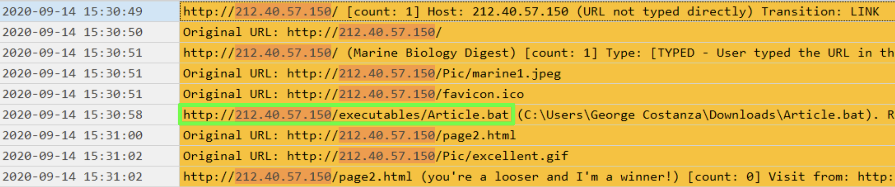

# Solution
(we might tell Art Vandeley you peeked this time)

This solution was written in a certain way, but there are more ways to reach the same results. 
take this sheet as a recommendation and nothing more.


### Tools used in this solution:
* Windows 10
* Tsurugi Linux 2020
* [FTK Imager from AccessData](https://www.exterro.com/ftk-product-downloads/ftk-imager-4-7-3-81)
* [Plaso Log2timeline for windows](https://github.com/log2timeline/plaso)
* [Shellbag Explorer](https://ericzimmerman.github.io/#!index.md)
* [Timeline Explorer](https://ericzimmerman.github.io/#!index.md)
* Offline registry viewer of choosing
* Latest [Python](https://www.python.org/) available

First let’s make the registry investigation easier by extracting the desired hives to a more accessible location using FTK Imager:
1. Open the FTK Imager and press File > Add Evidence Item…
2. Choose Image File and press Next
3. Browse to the location of the image and press Finish
4. Now we can view the disk image in a more file-system kind of state
5. Browse to the location of the desired hives and extract them to a location of your choosing
6. Mark the selected files to extract, right-click and press Export Files... 


Hives locations: 
* SYSTEM, SOFTWARE, SECURITY, SAM and DEFAULT - C:\Windows\System32\config
* NTUSER - C:\Users\<username>
* UsrClass - C:\Users\<username>\AppData\Local\Microsoft\Windows

### What was George doing instead of working?
In order to trace the user's activity, it is vital to create a timeline.

Steps of creating a timeline:
1. Mounting the image with FTK Imager:
   1. Open the FTK Imager and press File > Image Mounting…
   2. Browse for the disk image and press Mount
   3. The image will be mounted with (FTK chooses the next available letter by default unless told otherwise)


2. Launch cmd or powershell with admin rights (WinKey + X > Windows PowerShell (Admin))
3. cd to the folder containing `log2timeline.exe` and psort.exe. for example - cd C:\Users\Username\Desktop\Project\plaso
4. Now we need to create a dump file from the image so that plaso can read it by pressing in PowerShell:
    ```
    log2timeline.exe plaso.dump H:
    ```
   * plaso.dump is the file name for the dump, you can name it whatever you like
   * H: Is the mounted image we already did with FTK Imager (the drive letter may vary depending on your system).

5. After the dump file is created, we want to make it into a readable clear-text format that Timeline Explorer can read and display
    
    ```
    psort.exe -o l2tcsv -w output.csv plaso.dump
    ```
   
   * `-o` to output to csv
   * `-w` to set the output file
   * `output.csv` is the output file
   * `plaso.dump` is the input file
6. Load `output.csv` into Timeline Explorer

Notes about timeline creation:
* The process could take between 2 and 5 hours, sometimes more.
* The output of the CSV file could potentially be very large.
  * We can parse the output by entering specific dates
  * Or parse for more specific purposes of the investigation or about the filesystem we wish to create the timeline for.
  * If the output is still large, it is possible to use CSV splitter such as Free Huge CSV Splitter
* If the timezone of the disk being examined and the machine that creates the timeline is not the same, it is advised to enter a Timezone flag and explicitly enter the correct timezone.

After completing the process of creating the timeline and loading it in Timeline Explorer, we can see a lot of web activity regarding marine biology on Aug 12 2020.


And then some more on Aug 25 2020


We learn that George is interested in Marine Biology. 
from the timestamps, it appears he prefers reading about the subject more than his work.

### How could George fall for it? What did the attacker have to know in order to succeed?

We know that Vandelay Industries works with a local email server, but the software used in Vandelay Industries is Thunderbird Mail by Mozilla that does not keep a local archive file such as Outlooks PST.
Knowing Thunderbird, it keeps the eml files in the Temp folder at `C:\Users\<Username>\AppData\Local\Temp`

We can see the files named `nsemail-#.eml`, more particularly nsemail-4.eml:


We learn that George got an email from "info@marbiodigest.net" asking him to join their mailing list on Sep 14 2020 with a link that redirects George to the IP of **212.40.57.150**.
Someone needed to know he likes the field of Marine Biology.

### What is the infection file’s name?

Searching this address in Timeline Explorer shows that a file has been downloaded


### What is the infection file’s name?
We saw that the file that George downloaded was called “Article.bat”.
Searching for that file name did not produce any results:
```
fls -o 206848 george-disk.raw -rp | grep -i article.bat
```

It is safe to assume that the attacker left the file in the system in a non visible place in order to maybe have another access to George's computer. we can search for the file extension only:
```
fls -o 206848 george-disk.raw -rp | grep -i -E ".bat$"
```

The search produces only 5 results. one of which is the “New” or the same file with a different name that the attacker did while inside the system.


Notice that the file path is now: "C:\Windows\------\Po\st\--\Ma\n\--\did\--\this" and the file name is now `Marine-Story.bat`

### Show a proof of the infection file execution

Each time that a user starts using a new application, the Windows operating system automatically extracts the application name from the version resource of the exe file, and stores it for later use in a Registry key known as the `MuiCache`.

First we need to mount the disk image.
To mount an image using the Image command:
1. Create a folder for the image - `sudo mkdir /mnt/george-disk`
2. Enter the mount command - `sudo mount -t ntfs -o ro,offset=105906176 george-disk.raw /mnt/george-disk/`
   1. `-t` is for the type of file system (visible through `mmls` command)
   2. `-o` is for the options
      * ro - read only
      * offset is the offset * the sector size (also visible through mmls command)
   3. george-disk.raw is the name of the image (relative path)
   4. `/mnt/george-disk/` is the location of the mount in the folder we created in step 1


Now that the image is mounted, we can use the Tsurugi built-in function called rip.pl that uses the same principle as RegRipper.

`rip.pl` has a built-in plugin for the `MUICache`:
```
rip.pl -r UsrClass -p muicache
```
* `-r` is for the registry hive location (relative path)
* `-p` is for plugin. in this case, muicache.


Note: the MUICache stores the current file location path and not the path of the file of which it was executed.

### What was George's user password?
We can use a built-in tool that comes with Tsurugi called samdump2.
samdump2 uses the SYSTEM and SOFTWARE registry hives.
```
samdump2 SYSTEM SAM
```

We get a list of the password hashes:


We get the results for all the users on the computer.
After converting the result for George Costanza’s user (846d50061cf62033d6590d7ef92e70a6) in CrackStation we get the password **festivus**.

### Shared Folders

To see mapped network drives, we can use the Tsurugi built-in function called rip.pl that uses the same principle as RegRipper.
```
rip.pl -r NTUSER -p ntusernetwork
```


And so we see that there is a mapped network drive mapped to the letter Z with the remote path of \\jerry-pc\Users
We can verify the results and take a look at the ShellBags
* Open `ShellBags explorer`
* File > Load offline hive… or press Ctrl + O
* Load the `UsrClass` hive

We can see that there's a `Z` drive and inside is a folder called "Jerry S".


We can also see an Unmapped drive with a folder that matches the materials the client said were stolen

**Note**: Shellbags information displays only folders that the user accessed. That means that the attacker may have copied a lot more folders and files than presented in the UsrClass hive by the Shellbags Explorer.

Evidence of mapped network drive can also be shown in the registry at:
`NTUSER\Software\Microsoft\Windows\CurrentVersion\Explorer\MountPoints2`


## Who can we suspect for the attack?
Reading further in the email correspondence reveals that George sent an email back to info@marbiodigest.net and got a reply from the same address. this time, the name on the email was Newman


Searching for the value "newman" in the Timeline Explorer:


We can also see a remote connection in the Windows Event Logs at `C:\Windows\System32\winevt\Logs`


So now we know... the attacker was... Newman!

