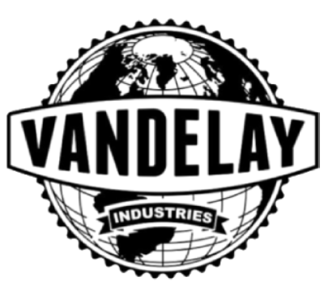

# George is in too deep
Before diving into the story an important disclaimer, this is a made-up story based on the television series Seinfeld - all rights goes to the original show and it's creators for characters names and other features and references that may connect to the original series!

The story is a network and hard drive forensic investigation drill themed around the show Seinfeld and "Vandeley Industries"
It is to note that even though this is inspired by a television show, the scenarios are completely made up.

As for technical prerequisites, feel free to use any network investigation tools you fancy. 
On each solution sheet, there is a mention for which tools were used. Usually it is the most raw and open-source tools we could find.

## What is Vandeley Industries?
Vandelay Industries is a company founded by George Costanza along with Jerry Seinfeld, that is in the Import and Export business.
Import and Export of what? 
latex.... and....... latex based products.
 
yes.

ANYWAY! Vandelay Industries is a new and **upcoming company** with great potential, and is catching a lot of attention from its rivals and other opponents from beyond the field. which is latex. we think

What we do know is that the business was established in September 2019 and keeps growing by the day even though it only consists of two employees

## The Team

### The grand CEO - George Costanza

* Has a short temper
* Has tendency of being lazy
* Looks busy and let others do the work for him
* His email address is `george@vandelay.com`

### Jerry

* Mostly apathetic
* Tends to gossip
* Cynical - used to do stand-up comedy once
* His email address is `jerry@vandelay.com`

Some stuff we know because we just know, take our word for it:
1. The company communicates mostly via emails.
2. The company uses a file and data server.
3. The server provide more services than storage.